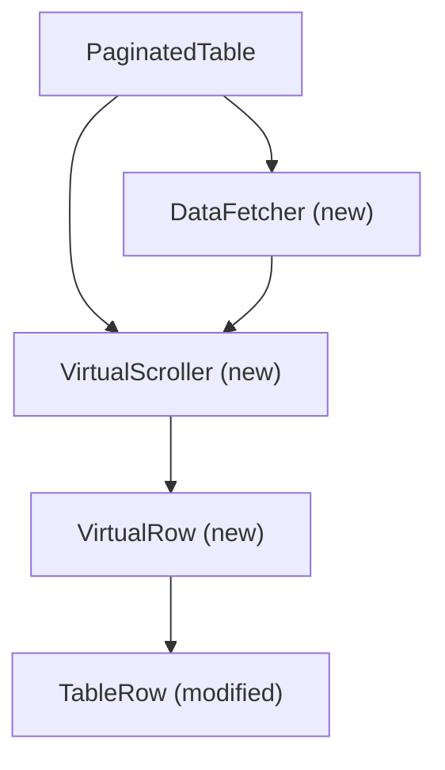

# PaginatedTable Performance Optimization

## Current Implementation Analysis

The PaginatedTable component is a virtualized table implementation that:

1. Divides the table into "chunks" (groups of rows)
2. Uses `useScrollBasedChunks` to determine which chunks are visible in the viewport
3. Only renders visible chunks plus a small overscan buffer
4. Each chunk fetches and renders its own data

## Identified Performance Bottlenecks

After analyzing the code, I've identified several potential causes for the scroll stuttering:

1. **Synchronous Rendering During Scroll**: The current implementation updates visible chunks during scroll events, which can cause the main thread to be blocked with rendering work while scrolling.

2. **Inefficient DOM Updates**: When scrolling, new chunks are rendered and old ones are unmounted, causing potentially expensive DOM operations during scroll.

3. **Layout Thrashing**: The code calculates element positions during scroll, which can cause layout thrashing (forced reflows).

4. **Render-Time Painting**: Complex row content is painted during scroll, which is causing the reported stuttering.

5. **Limited Virtualization**: The current implementation virtualizes at the chunk level, not the row level, which means all rows in a visible chunk are rendered even if they're not in the viewport.

## Architectural Solution Proposal

To achieve smooth 60fps scrolling independent of row content painting time, I propose the following architectural changes:

### 1. Implement DOM Recycling with Absolute Positioning

Instead of creating/destroying DOM elements during scroll, we'll use a fixed pool of row elements that are repositioned using absolute positioning. This approach:

- Minimizes DOM operations during scroll
- Allows for efficient element reuse
- Separates layout from painting

### 2. Decouple Scrolling from Rendering

We'll implement a two-phase rendering approach:

1. **Scroll Phase**: Only update positions of row containers using transforms (which don't trigger layout)
2. **Paint Phase**: After scrolling stops (or is idle), render the actual content of rows

### 3. Use CSS Containment for Performance Isolation

Apply CSS containment to rows to isolate their layout, style, and paint operations:

```css
contain: layout style paint;
```

### 4. Implement True Row-Level Virtualization

Replace chunk-based virtualization with row-level virtualization for finer-grained control and better performance.

### 5. Use RequestAnimationFrame for Scroll Handling

Ensure all scroll-related calculations happen in sync with the browser's rendering cycle.

## Detailed Implementation Plan

### Phase 1: Core Architecture Changes

1. **Create a new virtualization engine**

   - Implement row-level virtualization instead of chunk-based
   - Use absolute positioning for rows
   - Implement DOM recycling for row elements

2. **Separate scroll handling from content rendering**
   - Use `transform: translateY()` for positioning rows
   - Implement a delayed content rendering mechanism

### Phase 2: Component Refactoring

1. **Refactor PaginatedTable component**

   - Replace chunk-based rendering with row-based virtualization
   - Implement the new scroll handling logic

2. **Create a new VirtualRow component**

   - Handle positioning and recycling
   - Implement two-phase rendering (position first, content later)

3. **Update TableRow component**
   - Add CSS containment
   - Optimize rendering performance

### Phase 3: Data Fetching Optimization

1. **Implement more efficient data fetching**
   - Fetch data in larger chunks but render rows incrementally
   - Implement prefetching for upcoming rows

## Technical Design

### New Component Structure



### Key New Components

1. **VirtualScroller**

   - Manages the viewport and visible rows
   - Handles scroll events and positioning
   - Maintains a pool of reusable row elements

2. **VirtualRow**

   - Manages the lifecycle of a single row
   - Handles positioning and content rendering timing
   - Implements DOM recycling

3. **DataFetcher**
   - Decouples data fetching from rendering
   - Implements prefetching and caching strategies

### Implementation Details

#### 1. VirtualScroller Component

```typescript
interface VirtualScrollerProps<T> {
  items: T[];
  rowHeight: number;
  overscanCount?: number;
  renderRow: (item: T, index: number, style: React.CSSProperties) => React.ReactNode;
  onVisibleRowsChange?: (startIndex: number, endIndex: number) => void;
  scrollContainerRef: React.RefObject<HTMLElement>;
}
```

#### 2. VirtualRow Component

```typescript
interface VirtualRowProps<T> {
  item: T;
  index: number;
  style: React.CSSProperties;
  isVisible: boolean;
  renderContent: (item: T) => React.ReactNode;
}
```

#### 3. CSS Optimizations

```css
.virtual-row {
  position: absolute;
  left: 0;
  right: 0;
  contain: layout style paint;
  will-change: transform;
}

.virtual-row-content {
  /* Only painted when visible */
  opacity: 0;
  transition: opacity 0.1s;
}

.virtual-row-content.visible {
  opacity: 1;
}
```

## Migration Strategy

To ensure a smooth transition while maintaining all existing functionality:

1. Implement the new virtualization engine alongside the existing one
2. Create adapter components to ensure backward compatibility
3. Gradually migrate existing usage to the new components
4. Add comprehensive tests to verify performance and functionality

## Performance Metrics and Testing

To validate our solution:

1. Implement FPS monitoring during scroll
2. Measure Time to First Paint for rows
3. Measure Total Blocking Time during scroll
4. Compare performance with different row content complexity

## Expected Benefits

1. **Smooth 60fps scrolling** regardless of row content complexity
2. **Reduced memory usage** due to more efficient DOM element reuse
3. **Improved perceived performance** with the two-phase rendering approach
4. **Better scalability** for tables with thousands of rows
5. **Maintained functionality** with all existing features preserved

## Implementation Progress Update

**Date**: 2025-05-24
**Decision ID**: 2 (ConPort)
**Progress ID**: 5 (ConPort)
**Status**: Implementation Complete - Performance Testing Pending

### What Has Been Implemented

The architectural changes outlined in this performance optimization plan have been implemented:

#### ✅ Core Architecture Changes (Phase 1)

- **Row-level virtualization engine** implemented in `useVirtualRows.ts`
- **DOM recycling** with element pool for memory efficiency
- **GPU-accelerated positioning** using `transform: translateY()` instead of `top` property
- **CSS containment** applied for performance isolation

#### ✅ Component Refactoring (Phase 2)

- **VirtualizedRow component** created for absolute positioning and recycling
- **VirtualizedTableContent component** for cross-browser compatibility
- **TableRow component** updated with style props and data attributes
- **PaginatedTable component** refactored to use new virtualization

#### ✅ Data Fetching Optimization (Phase 3)

- **Request caching** implemented in `useChunkFetcher.ts` to prevent duplicate API calls
- **Debouncing** added to prevent excessive requests during scrolling
- **Memory management** for cache size control

### Technical Solutions Implemented

1. **Cross-Browser Compatibility**: Solved Safari-specific scroll area issues with hidden spacer row
2. **DOM Nesting Validation**: Resolved HTML structure issues by passing styles directly to TableRow
3. **Performance Isolation**: Implemented CSS containment (`contain: layout style paint`)
4. **GPU Acceleration**: Used `transform: translateY()` for positioning
5. **Valid HTML Structure**: Maintained proper table semantics

### Next Steps Required

**Performance Validation Needed:**

- [ ] FPS monitoring during scroll testing
- [ ] Time to First Paint measurements for rows
- [ ] Total Blocking Time during scroll analysis
- [ ] Performance comparison with different row content complexity
- [ ] Memory usage profiling
- [ ] Cross-browser performance testing

**Expected Benefits (To Be Validated):**

- Smooth 60fps scrolling regardless of row content complexity
- Reduced memory usage through DOM element recycling
- Lower network traffic through intelligent request caching
- Better scalability for tables with thousands of rows

### Implementation Files

**New Components:**

- `src/components/PaginatedTable/useVirtualRows.ts` - Core virtualization logic
- `src/components/PaginatedTable/VirtualizedRow.tsx` - GPU-accelerated row component
- `src/components/PaginatedTable/useChunkFetcher.ts` - Cached data fetching
- `src/components/PaginatedTable/VirtualizedTableContent.tsx` - Cross-browser table content

**Modified Components:**

- `src/components/PaginatedTable/TableRow.tsx` - Added style and data-index props
- `src/components/PaginatedTable/PaginatedTable.tsx` - Updated to use new virtualization

### Documentation

- [Implementation Details](./PaginatedTable_Virtualization_Implementation.md)
- [Product Context](./PaginatedTable_ProductContext.md)

---

**Current Status**: Implementation complete, performance validation pending
