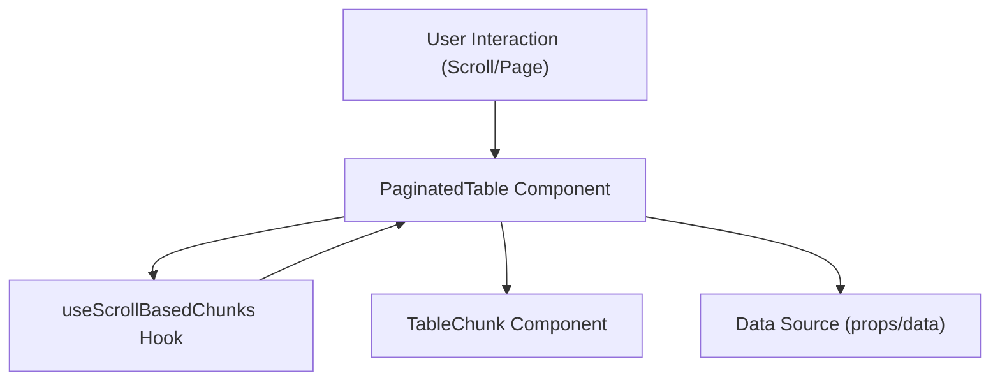

# Product Context: PaginatedTable

## Overview

**PaginatedTable** is a generic, highly-performant React table component designed for large datasets. It implements virtualized pagination by dividing the table into "chunks" (groups of rows) and only rendering those currently visible in the viewport, plus a small overscan buffer.

The main component manages state via context and props, and delegates chunk visibility to the `useScrollBasedChunks` hook. Each chunk is rendered by the `TableChunk` component, which fetches its own data slice and handles loading, error, and empty states. The system is optimized for minimal re-renders and supports features like custom row rendering, dynamic filters, column resizing, and server-side data fetching.

The architecture is modular, with clear separation between chunk calculation, data fetching, and rendering. This design enables smooth scrolling and efficient memory usage even with very large tables.

---

## Key Files

- `src/components/PaginatedTable/PaginatedTable.tsx`
- `src/components/PaginatedTable/useScrollBasedChunks.ts`
- `src/components/PaginatedTable/TableChunk.tsx`

---

## Core Logic

- **Chunking:**  
  `useScrollBasedChunks` calculates which chunks (groups of rows) are visible based on scroll position, window size, and overscan. It returns a boolean array indicating active chunks.

- **Data Fetching:**  
  Each `TableChunk` fetches its own data slice using `tableDataApi`, with debounce and auto-refresh logic. Chunks are memoized to avoid unnecessary re-renders.

- **Rendering:**  
  `PaginatedTable` renders a table with a `TableHead` and a set of `TableChunk` components. Each chunk handles its own loading, error, and empty states, and renders rows using `TableRow`.

- **State Management:**  
  State is managed via context (`usePaginatedTableState`) and local state for filters and chunk visibility. Initial sort and entity counts can be set via props.

---

## Extensibility

- Custom row rendering via `getRowClassName`
- Custom error/empty messages
- Column resizing
- Server-side filtering and sorting

---

## Performance

Optimized for large datasets with virtualized rendering, chunk memoization, and throttled scroll/resize handlers.

---

## Data Flow & Component Relationships

---

---

## 1. Component API & Data Flow

### PaginatedTable Props

| Prop                     | Type                                    | Description                                                            |
| ------------------------ | --------------------------------------- | ---------------------------------------------------------------------- |
| `limit`                  | `number`                                | Number of rows per chunk (pagination size). Defaults to 20.            |
| `initialEntitiesCount`   | `number`                                | Initial total number of entities (rows).                               |
| `fetchData`              | `FetchData<T, F>`                       | Function to fetch data for the table.                                  |
| `filters`                | `F`                                     | Filters to apply to the data.                                          |
| `tableName`              | `string`                                | Name of the table (for data fetching and identification).              |
| `columns`                | `Column<T>[]`                           | Array of column definitions.                                           |
| `getRowClassName`        | `GetRowClassName<T>`                    | Optional function to provide custom class names for rows.              |
| `rowHeight`              | `number`                                | Height of each row in pixels. Defaults to `DEFAULT_TABLE_ROW_HEIGHT`.  |
| `scrollContainerRef`     | `React.RefObject<HTMLElement>`          | Ref to the scrollable container element.                               |
| `initialSortParams`      | `SortParams`                            | Initial sorting parameters.                                            |
| `onColumnsResize`        | `HandleTableColumnsResize`              | Optional callback for column resize events.                            |
| `renderEmptyDataMessage` | `RenderEmptyDataMessage`                | Optional function to render a custom message when no data is present.  |
| `renderErrorMessage`     | `RenderErrorMessage`                    | Optional function to render a custom error message.                    |
| `containerClassName`     | `string`                                | Optional class name for the table container.                           |
| `onDataFetched`          | `(data: PaginatedTableData<T>) => void` | Optional callback invoked when data is fetched.                        |
| `keepCache`              | `boolean`                               | Whether to keep chunk data cached between renders. Defaults to `true`. |

---

### TableChunk Props

| Prop                     | Type                                     | Description                                                                     |
| ------------------------ | ---------------------------------------- | ------------------------------------------------------------------------------- |
| `id`                     | `number`                                 | Chunk index.                                                                    |
| `chunkSize`              | `number`                                 | Number of rows in this chunk.                                                   |
| `calculatedCount`        | `number`                                 | Actual number of rows to render in this chunk (may be less for the last chunk). |
| `rowHeight`              | `number`                                 | Height of each row in pixels.                                                   |
| `columns`                | `Column<T>[]`                            | Array of column definitions.                                                    |
| `filters`                | `F`                                      | Filters to apply to the data.                                                   |
| `sortParams`             | `SortParams`                             | Sorting parameters.                                                             |
| `isActive`               | `boolean`                                | Whether this chunk is currently visible/active.                                 |
| `tableName`              | `string`                                 | Name of the table.                                                              |
| `fetchData`              | `FetchData<T, F>`                        | Function to fetch data for this chunk.                                          |
| `getRowClassName`        | `GetRowClassName<T>`                     | Optional function for custom row classes.                                       |
| `renderErrorMessage`     | `RenderErrorMessage`                     | Optional function for custom error messages.                                    |
| `renderEmptyDataMessage` | `RenderEmptyDataMessage`                 | Optional function for custom empty data messages.                               |
| `onDataFetched`          | `(data?: PaginatedTableData<T>) => void` | Callback when data is fetched.                                                  |
| `keepCache`              | `boolean`                                | Whether to keep chunk data cached.                                              |

---

### useScrollBasedChunks Props

| Prop                 | Type                           | Description                                                                            |
| -------------------- | ------------------------------ | -------------------------------------------------------------------------------------- |
| `scrollContainerRef` | `React.RefObject<HTMLElement>` | Ref to the scrollable container.                                                       |
| `tableRef`           | `React.RefObject<HTMLElement>` | Ref to the table element.                                                              |
| `totalItems`         | `number`                       | Total number of items (rows) in the table.                                             |
| `rowHeight`          | `number`                       | Height of each row.                                                                    |
| `chunkSize`          | `number`                       | Number of rows per chunk.                                                              |
| `overscanCount`      | `number`                       | Number of extra chunks to render before/after the visible area (for smooth scrolling). |

---

### Data Flow Overview

1. **Props** are passed from the parent to `PaginatedTable`, which manages high-level state and passes relevant props to `useScrollBasedChunks` and each `TableChunk`.
2. **useScrollBasedChunks** determines which chunks are visible based on scroll position and returns a boolean array indicating active chunks.
3. **PaginatedTable** renders a `TableHead` and a set of `TableChunk` components, one for each chunk.
4. **Each TableChunk** fetches its own data slice and manages its own loading, error, and empty states.
5. **Callbacks** like `onDataFetched` propagate data and state changes back up to `PaginatedTable` or the parent.

---
